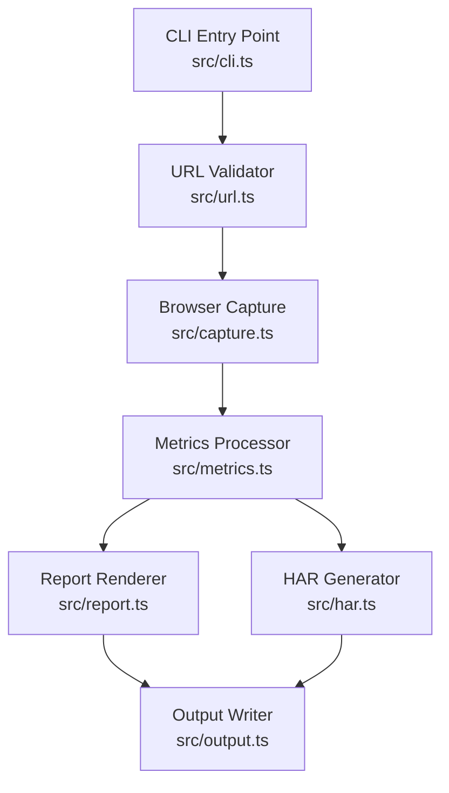

# Design Document: Network Tab Analyzer

## Overview

The Network Tab Analyzer is a Node.js/TypeScript CLI tool that automates what a developer does manually in the browser DevTools Network tab. Given a URL, it launches a headless Chromium browser via Playwright, intercepts all network traffic during page load, computes metrics, and emits a structured GitHub-Flavored Markdown report. Optionally it exports a HAR 1.2 file for import into external tools.

The tool is designed as a pipeline of pure, composable stages:

```
CLI args → URL validation → Browser capture → Data transformation → Report/HAR rendering → Output
```

Each stage is independently testable. The browser capture stage is the only one with external dependencies (Playwright/Chromium); all other stages are pure functions amenable to property-based testing.

**Technology choices:**
- **Runtime**: Node.js 20+ with TypeScript
- **Headless browser**: Playwright (Chromium) — chosen over Puppeteer for its superior network interception API, built-in `networkidle` wait strategy, and first-class TypeScript support
- **CLI parsing**: `commander` — mature, well-typed, handles `--help` generation automatically
- **Property-based testing**: `fast-check` — the most capable PBT library for TypeScript/JavaScript
- **Test runner**: Vitest — fast, native TypeScript, compatible with fast-check

---

## Architecture



**Design rationale**: The strict separation between capture (I/O, side-effectful) and processing/rendering (pure functions) is intentional. It makes the processing logic fully testable without a browser, and makes the capture layer swappable (e.g., replacing Playwright with another driver) without touching any downstream logic.

---

## Components and Interfaces

### CLI Entry Point (`src/cli.ts`)

Parses arguments using `commander`, wires components together, handles top-level error formatting, and routes output. Writes progress indicators to `stderr` so `stdout` remains clean for piping.

```typescript
// Entry point — thin orchestration only, no business logic
async function main(): Promise<void>
```

### URL Validator (`src/url.ts`)

Pure functions for URL normalization and validation. No I/O.

```typescript
type UrlValidationResult =
  | { ok: true; url: string }
  | { ok: false; error: string };

// Prepends https:// if no scheme present, then validates
function normalizeAndValidate(input: string): UrlValidationResult;

// Exposed for testing
function normalizeUrl(input: string): string;
function validateUrl(normalized: string): UrlValidationResult;
```

**Normalization rule**: If the input does not start with `http://` or `https://`, prepend `https://`. Then attempt `new URL(normalized)` — if it throws, the URL is structurally invalid. If the resulting protocol is not `http:` or `https:`, reject with a scheme error.

### Browser Capture (`src/capture.ts`)

The only component with external I/O. Launches Playwright Chromium, attaches request/response listeners, navigates to the URL, waits for `networkidle`, and returns a `CaptureResult`.

```typescript
interface CaptureOptions {
  url: string;
  timeoutMs: number; // default 30000
}

interface CaptureResult {
  requests: NetworkRequest[];
  captureTimestamp: string; // ISO 8601
  totalDurationMs: number;
}

async function captureNetwork(options: CaptureOptions): Promise<CaptureResult>;
```

Playwright's `page.on('request')` and `page.on('response')` events are used to build a request map keyed by request ID. On `requestfinished` and `requestfailed`, the entry is finalized with timing and status data.

**Network idle definition**: Playwright's built-in `waitUntil: 'networkidle'` waits until there are no more than 2 in-flight requests for at least 500ms — this matches Requirement 2.3 exactly.

### Network Request Model (`src/types.ts`)

```typescript
type ResourceType =
  | 'document' | 'script' | 'stylesheet' | 'image'
  | 'xhr' | 'fetch' | 'font' | 'media' | 'other';

interface NetworkRequest {
  url: string;
  method: string;
  resourceType: ResourceType;
  statusCode: number | null;   // null for failed requests
  sizeBytes: number;
  ttfbMs: number;
  durationMs: number;
  requestHeaders: Record<string, string>;
  responseHeaders: Record<string, string>;
  failed: boolean;
  errorText?: string;
}
```

### Metrics Processor (`src/metrics.ts`)

Pure functions. No I/O.

```typescript
interface AggregateMetrics {
  totalRequests: number;
  totalBytes: number;
  totalDurationMs: number;
}

interface TypeMetrics {
  resourceType: ResourceType;
  count: number;
  totalBytes: number;
  avgDurationMs: number;
}

interface ProcessedData {
  requests: NetworkRequest[];
  aggregate: AggregateMetrics;
  byType: TypeMetrics[];
  slowest: NetworkRequest[];   // top 5 by durationMs
  errors: NetworkRequest[];    // statusCode >= 400 or failed === true
}

function processRequests(requests: NetworkRequest[]): ProcessedData;
function groupByType(requests: NetworkRequest[]): Map<ResourceType, NetworkRequest[]>;
function computeAggregate(requests: NetworkRequest[]): AggregateMetrics;
function computeTypeMetrics(requests: NetworkRequest[]): TypeMetrics[];
function getSlowest(requests: NetworkRequest[], n: number): NetworkRequest[];
function getErrors(requests: NetworkRequest[]): NetworkRequest[];
```

### Report Renderer (`src/report.ts`)

Pure function. Takes `ProcessedData` + metadata and returns a Markdown string.

```typescript
interface ReportInput {
  url: string;
  captureTimestamp: string;
  totalDurationMs: number;
  data: ProcessedData;
}

function renderReport(input: ReportInput): string;
function formatBytes(bytes: number): string;   // e.g., "1.2 MB"
function truncateUrl(url: string, maxLen: number): string;  // truncate to 80 chars
```

Report sections (in order per Requirement 4.2):
1. Summary
2. Request Breakdown by Type
3. Slowest Requests
4. Errors and Failed Requests
5. Full Request Log

### HAR Generator (`src/har.ts`)

Pure function. Converts `NetworkRequest[]` to a HAR 1.2 JSON object.

```typescript
interface HarFile {
  log: {
    version: '1.2';
    creator: { name: string; version: string };
    entries: HarEntry[];
  };
}

function generateHar(requests: NetworkRequest[], captureTimestamp: string): HarFile;
function parseHar(json: string): NetworkRequest[];  // for round-trip testing
```

### Output Writer (`src/output.ts`)

Handles writing to file or stdout. The only I/O in the output path.

```typescript
async function writeOutput(content: string, filePath?: string): Promise<void>;
```

---

## Data Models

### NetworkRequest (canonical internal model)

All captured data flows through this type. It is the single source of truth between capture, processing, rendering, and HAR export.

```typescript
interface NetworkRequest {
  url: string;
  method: string;                          // GET, POST, etc.
  resourceType: ResourceType;
  statusCode: number | null;               // null = request failed before response
  sizeBytes: number;                       // response body size in bytes
  ttfbMs: number;                          // time to first byte in ms
  durationMs: number;                      // total request duration in ms
  requestHeaders: Record<string, string>;
  responseHeaders: Record<string, string>;
  failed: boolean;
  errorText?: string;                      // present when failed === true
}
```

### HAR 1.2 Entry (subset used)

```typescript
interface HarEntry {
  startedDateTime: string;   // ISO 8601
  time: number;              // total duration ms
  request: {
    method: string;
    url: string;
    headers: Array<{ name: string; value: string }>;
    bodySize: number;
  };
  response: {
    status: number;
    headers: Array<{ name: string; value: string }>;
    content: { size: number; mimeType: string };
    bodySize: number;
  };
  timings: {
    wait: number;   // TTFB
    receive: number;
  };
}
```

---

## Correctness Properties

*A property is a characteristic or behavior that should hold true across all valid executions of a system — essentially, a formal statement about what the system should do. Properties serve as the bridge between human-readable specifications and machine-verifiable correctness guarantees.*

### Property 1: URL scheme normalization

*For any* string that does not begin with `http://` or `https://`, `normalizeUrl` SHALL return a string that begins with `https://` followed by the original input.

**Validates: Requirements 1.2**

---

### Property 2: URL validation rejects all invalid inputs

*For any* structurally invalid URL string or any URL string with a non-http/https scheme, `validateUrl` SHALL return `{ ok: false }`.

**Validates: Requirements 1.3, 1.4**

---

### Property 3: Request field mapping completeness

*For any* mock Playwright request/response pair, the mapped `NetworkRequest` SHALL contain non-null values for all required fields: `url`, `method`, `resourceType`, `sizeBytes`, `ttfbMs`, `durationMs`, `requestHeaders`, `responseHeaders`.

**Validates: Requirements 2.2**

---

### Property 4: Failed requests are always recorded

*For any* list of `NetworkRequest` objects that includes failed requests (where `failed === true`), `processRequests` SHALL include all failed requests in the returned `requests` array.

**Validates: Requirements 2.5**

---

### Property 5: Grouping correctness

*For any* list of `NetworkRequest` objects, `groupByType` SHALL produce a map where every request in each group has the same `resourceType` as the group key, and the union of all groups equals the original list.

**Validates: Requirements 3.1**

---

### Property 6: Metrics computation correctness

*For any* list of `NetworkRequest` objects, `computeAggregate` SHALL return totals that equal the exact sum of individual `sizeBytes` and `durationMs` values, and `computeTypeMetrics` SHALL return per-type averages consistent with the requests in each type group.

**Validates: Requirements 3.2, 3.3**

---

### Property 7: Slowest requests selection

*For any* list of `NetworkRequest` objects with at least 5 entries, `getSlowest(requests, 5)` SHALL return exactly 5 requests, all of which have `durationMs` greater than or equal to the `durationMs` of every request not in the result.

**Validates: Requirements 3.4**

---

### Property 8: Error requests filter

*For any* list of `NetworkRequest` objects, `getErrors` SHALL return exactly those requests where `statusCode >= 400` or `failed === true`, and no others.

**Validates: Requirements 3.5**

---

### Property 9: Report structure completeness

*For any* `ReportInput`, `renderReport` SHALL return a string containing all five required section headings in order: "Summary", "Request Breakdown by Type", "Slowest Requests", "Errors and Failed Requests", "Full Request Log". The Summary section SHALL contain the analyzed URL, a timestamp, total request count, total bytes (human-readable), and total duration.

**Validates: Requirements 4.2, 4.3**

---

### Property 10: Full request log completeness

*For any* list of `NetworkRequest` objects, every request's URL (truncated to 80 characters) SHALL appear as a row in the Full Request Log section of the rendered report.

**Validates: Requirements 4.4**

---

### Property 11: HAR structure validity

*For any* list of `NetworkRequest` objects, `generateHar` SHALL return an object with `log.version === '1.2'` and `log.entries.length === requests.length`, where each entry contains valid `request`, `response`, and `timings` sub-objects.

**Validates: Requirements 5.1, 5.3**

---

### Property 12: HAR round-trip

*For any* list of `NetworkRequest` objects, serializing to HAR via `generateHar`, then parsing via `parseHar`, then serializing again, then parsing again SHALL produce a list of entries equivalent to the first parse result.

**Validates: Requirements 5.4**

---

## Error Handling

| Scenario | Behavior |
|---|---|
| Missing URL argument | Print usage hint to stderr, exit code 1 |
| Invalid/unsupported URL | Print descriptive error to stderr, exit code 1 |
| Page load timeout (>30s) | Close browser, print timeout error to stderr, exit code 1 |
| Network request failure | Record request with `failed: true`, continue capture |
| Unwritable output file | Print path + OS error to stderr, exit code 1 |
| `--har` flag without path | Print usage error to stderr, exit code 1 |
| Unrecognized CLI flag | Print flag name + usage hint to stderr, exit code 1 |
| Unexpected runtime error | Print error message + stack to stderr, exit code 1 |

All user-facing errors go to `stderr`. `stdout` is reserved exclusively for the Markdown report (when no `--output` flag is given). Progress messages ("Loading page...", "Capturing network activity...", "Generating report...") also go to `stderr`.

---

## Testing Strategy

### Dual Testing Approach

Unit/property tests cover all pure functions (URL validation, metrics, report rendering, HAR generation). Integration tests cover the browser capture layer with a local HTTP server.

### Property-Based Tests (fast-check, minimum 100 iterations each)

Each property test references its design property via a comment tag:
`// Feature: network-tab-analyzer, Property N: <property text>`

| Property | Module | Generator Strategy |
|---|---|---|
| P1: URL normalization | `src/url.ts` | `fc.string()` filtered to exclude http/https prefixes |
| P2: URL validation rejects invalid | `src/url.ts` | `fc.string()` for invalid; `fc.constantFrom('ftp://', 'file://', 'ws://')` + domain for bad schemes |
| P3: Request field mapping | `src/capture.ts` (mapper fn) | `fc.record()` generating mock Playwright request/response shapes |
| P4: Failed requests recorded | `src/metrics.ts` | `fc.array(fc.record(...))` with `failed: true` entries mixed in |
| P5: Grouping correctness | `src/metrics.ts` | `fc.array(networkRequestArbitrary())` |
| P6: Metrics computation | `src/metrics.ts` | `fc.array(networkRequestArbitrary(), { minLength: 1 })` |
| P7: Slowest selection | `src/metrics.ts` | `fc.array(networkRequestArbitrary(), { minLength: 5 })` |
| P8: Error filter | `src/metrics.ts` | `fc.array(networkRequestArbitrary())` with mixed status codes |
| P9: Report structure | `src/report.ts` | `fc.record()` generating valid `ReportInput` |
| P10: Full log completeness | `src/report.ts` | `fc.array(networkRequestArbitrary(), { minLength: 1 })` |
| P11: HAR structure validity | `src/har.ts` | `fc.array(networkRequestArbitrary())` |
| P12: HAR round-trip | `src/har.ts` | `fc.array(networkRequestArbitrary())` |

A shared `networkRequestArbitrary()` fast-check arbitrary will be defined in `src/__tests__/arbitraries.ts` to generate valid `NetworkRequest` objects with realistic field distributions.

### Unit/Example Tests

- URL normalization with concrete inputs (bare domain, path-only, already-prefixed)
- CLI `--help` output and exit code 0
- CLI with no arguments: stderr hint, exit code 1
- CLI with unrecognized flag: error message, exit code 1
- `--output` writes to temp file with correct content
- `--output` to unwritable path: error, exit code 1
- `--har` without path argument: error, exit code 1
- `formatBytes` with known values (0, 999, 1024, 1048576, etc.)
- `truncateUrl` at exactly 80 chars, below, and above

### Integration Tests

Run against a local HTTP server (using Node's built-in `http` module, no external dependency):

- Full capture of a page with known resources: verify all requests appear in output
- Page with mixed 200/404 responses: verify errors section populated
- Page that never loads: verify 30s timeout error
- Progress messages appear on stderr, report on stdout

### Test File Structure

```
src/
  __tests__/
    arbitraries.ts       # shared fast-check arbitraries
    url.test.ts          # P1, P2 + unit tests
    metrics.test.ts      # P4, P5, P6, P7, P8 + unit tests
    report.test.ts       # P9, P10 + unit tests
    har.test.ts          # P11, P12 + unit tests
    capture.test.ts      # P3 (mapper fn) + integration tests
    cli.test.ts          # CLI smoke/example tests
```
